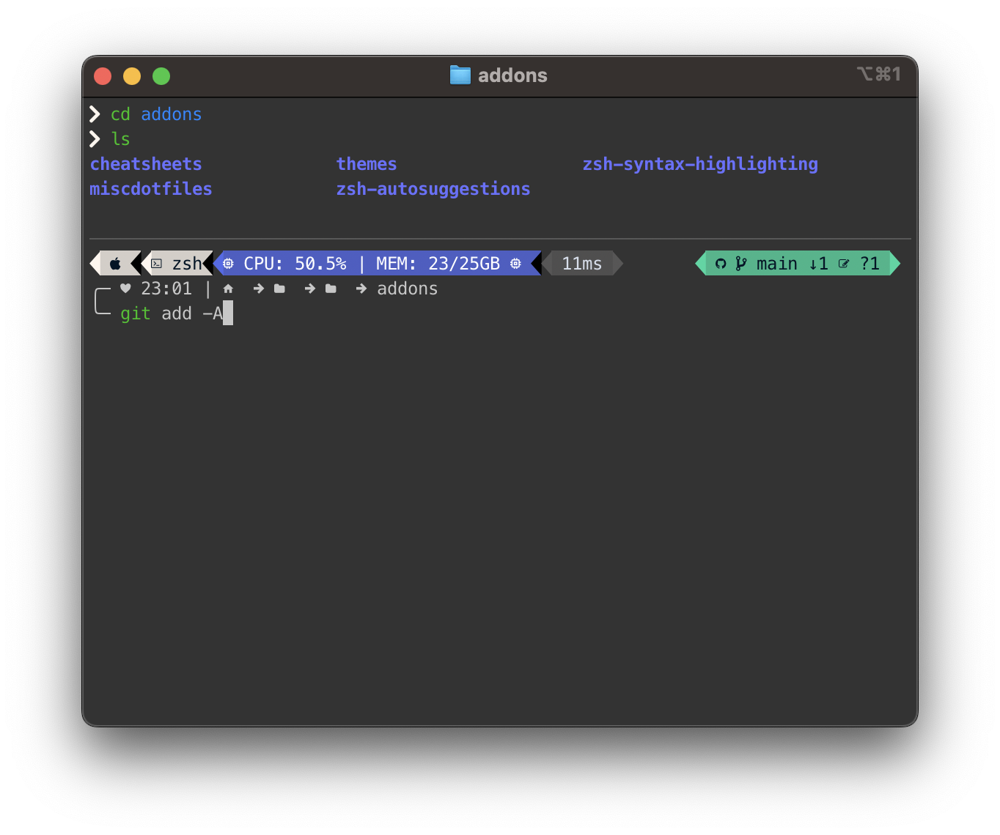

# Customizing your Mac's Zsh-Shell.

This is the Zsh configuration I use for my Mac. It's primarily based on [Lucas Costi's](https://github.com/lucascosti) settings which are part of his great [mac-config repo](https://github.com/lucascosti/mac-config).

I only use another customized theme and added some personal aliases to the ['.zshrc'](.zshrc).

The main files that do the work are:

* [`.zshrc`](.zshrc): Main settings file. It contains oh-my-zsh settings, Lucas' custom functions and my brew, git, directory, kubectl and flux aliases.
* [`addons/themes/clean-detailed-customized.omp.json`](addons/themes/clean-detailed-customized.omp.json): My custom [Oh My Posh](https://ohmyposh.dev/) theme file.

  Oh My Posh is a prompt customisation tool that allows you to do show fancy things on the prompt. On macOS, you must first [install it using brew](https://ohmyposh.dev/docs/installation/macos). Oh My Posh and the theme file are loaded from `.zshrc`.

The following [git submodules](https://git-scm.com/book/en/v2/Git-Tools-Submodules), which are stored in [`addons/`](zshscripts/), are part of the setting:

* [zsh-syntax-highlighting](https://github.com/zsh-users/zsh-syntax-highlighting) to enable syntax highlighting for the commands entered at the prompt.
* [zsh-autosuggestions](https://github.com/zsh-users/zsh-autosuggestions) to enable autosuggestions after the prompt.
* [cheat/cheatsheets](https://github.com/cheat/cheatsheets) for use with the [`cheat` command](https://github.com/cheat/cheat). The cheat command was installed using brew, but the cheatsheets are stored here. (See also the [cheat config file](addons/miscdotfiles/cheat/conf.yml).)

## Install with zsh-config.sh

The repo contains a script called [`zsh-config.sh`](zsh-config.sh) which checks all the prerequisites for the customized Zsh-Shell and will install missing packages. Moreover, it copies the [`.zshrc`](.zshrc) to your $HOME location.

> **Note**
> You first have to make the script executable by `chmod +x zsh-config.sh`

## How it's look like

## Contributing

Do you want to contribute? That’s great! Contributions are always welcome, no matter how large or small. If you found something odd, feel free to [submit a new issue](https://github.com/cypr0/mac-hardening/issues/), improve the code by [creating a pull request](https://github.com/cypr0/mac-hardening/pulls/), or by [sponsoring this project](https://github.com/sponsors/cypr0/).